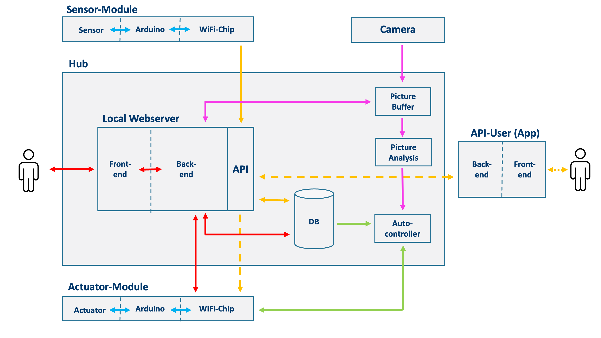

# Installation 
For the installation guide please refer to the [installation guide](./INSTALLATION.md) (INSTALLION.md)

# SmartGarden System

- [About SmartGarden 💡](#about-smartgarden)
- [Project Guidelines and Collaboration](#project-guidelines-and-collaboration)
    - [Getting Started](#getting-started)
    - [Contributing](#contributing)
    - [Dependencies](#dependencies)
- [System Architecture](#system-architecture)
    - [Components](#components)
    - [Communication](#communication-protocols)
    - [Restful API](#restful-api)
      - [Response HTTP Codes](#response-http-codes)
      - [Request and response: API endpoints: Api keys](#request-and-response-api-endpoints---api-keys)
      - [Sensors](#sensors)
      - [Actuators](#actuators)
      - [Cabeling](#cabeling)

## About SmartGarden

The SmartGarden system is an autonomous indoor gardening solution designed to provide users with a convenient and efficient way to manage their indoor plants. This project combines hardware and software components, including a webserver, a central hub, a database, sensors, actuators, and a picture analysis module.

## Project Guidelines and Collaboration

### Getting Started

* 1\. Clone the repository.
* 2\. Set up the required hardware components (Arduino, sensors, actuators) both hardware and software wise.
* 3\. On  **Mac**
  * 3.1 Run the setup script with `./setup.sh` 
  * 3.2 If the setup was succesful, run `./run.sh`
  * 3.3 Alternatively, one can run `./run.sh -s` to do 3.1 and 3.2 in one step. 
  * _Note: It is generally advised to run the setup script everytime a new version is realeased on main._
* 4\. On  **Linux**
  * 4.1 Follow steps from 3. to run the setup script
  * 4.2 If "Starting MySQL Server...Login failed" error encountered, follow [here](https://dev.mysql.com/doc/mysql-getting-started/en/) and [here](https://dev.mysql.com/doc/refman/8.0/en/resetting-permissions.html) to resolve
* 5\. On **Windows**
  * 5.1 Don't use Windows in the first place!
  * 5.2 Sorry, no installation and run script for you :(
  * 4.3 You will have to do everything that the script does by hand...
  


### Contributing

If you want to make changes to the code, please follow these guidelines:

* 1\. **Pull:** Pull the current repository.
* 2\. **Branch:** Create a branch for your feature, redesign, refactor, bug fix, etc. Follow the naming convention ``type/description``. _Example: ``bugfix/unresponsive_button``._
* 3\. **Code:** Make your changes and commit them. Follow the coding style of the project.
* 4\. **Tests:** Ensure that your code passes any existing tests.
* 6\. **Merge/Pull Request(PR):** Submit a merge request to the main repository, explaining your changes.
* 7\. **Review:** Participate in the code review process, addressing any feedback.

### Dependencies

Python depenedencies are listed under `requirements.txt`. One also has to have `mysql/mysql-server` installed on the system. A MySQL server has to be running and accessible with the login `'root'@'localhost'` with password `root`. If using **Linux** or **Mac**, it's your lucky day! You can simply use the setup and run scripts `setup.sh`/`run.sh`. 


## System Architecture



### Components

- **Sensor-Modules**
  - **Sensor**: Physical sensors, provide data which is _gathered_ by the _Arduino_. Find more information on Sensor in code [here](https://git.tu-berlin.de/aherbrich/pcps/-/tree/main/sensoren?ref_type=heads)
  - **Arduino**: Central control instance for _Sensors_. It has the task ofgetting the data from the _Sensors_, parsing the data to a sensible format and forwarding it to the _WiFi-Chip_ for transmission. Source code for Arduino available [here]()
  - **WiFi-Chip**: Communicates with the _Arduino_ over RX and TX pins. Sends the data recieved from the _Arduino_ to the _Hub_ over the home WiFi network.

- **Actuator-Modules**
  - **Actuator**: Physical actuators, controlled by the _Arduino_.
  - **Arduino**: Central control instance for _Actuators_. It has the task of getting commands from the _WiFi-Chip_, parsing the commands (which are in a sensible format) and controlling the _Actuators_ accordingly.
  - **WiFi-Chip**: Recieves commands from the _Hub_ over the home WiFi network and forwards them to the _Arduino_ over RX and TX pins. Source code for WiFi Actuator available [here](https://git.tu-berlin.de/aherbrich/pcps/-/blob/main/sensoren/actuator_wifi.ino?ref_type=heads)

- **Camera**

  The camera takes pictures of the plants multiple times a day, in regular intervals. These pictures are then transferred to the Hub for analysis and is shown on the API interface.

- **Hub**
  - **Local Webserver**:
    
    The local webserver is a webserver running on the hub in the local WiFI network. It has two main jobs: **(a)** It supplies a web interface for the user to interact with the system. One can view this like an web interface of a home router. **(b)** It provides an API such that Sensor-Modules can send their data to the hub. Additionally, it serves as a "classic" API, such that API-Users (like an Smartphone-App) can interact with the system.
    - **Frontend**: The frontend is the web interface for the user to interact with the system. It is written in HTML, CSS and JavaScript. It communicates with the backend.
    - **Backend**: The backend is the brain of the webserver. It **(a)** retrieves data from the database to be displayed, **(b)** stores/updates data in the database if the user make changes to the system over the web interface and **(c)** communicates with the Actuator-Modules if the user toggles an actuator over the web interface. _Note: The backend explicitly does not use the API provided by the local webserver. It directly communicates with the Actuator-Modules over the local WiFi network. Find more on Front- and Backend [here](https://git.tu-berlin.de/aherbrich/pcps/-/tree/main/hub/webserver?ref_type=heads)._
    - **API**: The API provides an endpoint for the Sensor-Modules to send their data to the local webserver. It also provides endpoints to: **(a)** control Actuator-Modules, **(b)** retrieve sensor data from the database and **(c)** fetch actuator status. It can be viewed as a controlled way to grant access to the system aside from the web interface. Code for API available [here](https://git.tu-berlin.de/aherbrich/pcps/-/tree/main/hub/webserver/api?ref_type=heads)
  - **Database**: The database stores all the data of the system. This includes sensor data, device information, user information, etc. Code on the Database is provided [here](https://git.tu-berlin.de/aherbrich/pcps/-/tree/main/hub/database?ref_type=heads)
  - **Autocontroller**: The autocontroller makes sure that the environment of the plants is kept within predefined ranges. It does so by controlling the Actuator-Modules. _Note: Currently not implemented yet, but the autocontroller will also be fed with Image Analysis data to make more informed decisions Code for the Autocontroller and the statuscodes for it available [here](https://git.tu-berlin.de/aherbrich/pcps/-/tree/main/hub/control?ref_type=heads)._
  - **Picture Buffer**: The picture buffer stores the pictures taken by the camera. It is used by the Picture Analysis module and the webserver backend. 
  - **Picture Analysis**: The image analysis module analyzes the pictures taken by the camera on the possible presense of illnesses. It provides information about the health state of the plants, which is used by the autocontroller to make more informed decisions. 

## Communication Protocols

The communication protocol between the Hub and the SmartGarden Web-App uses **HTTP**. The Hub provides a **RESTful API**, facilitating communication over HTTP and enabling integration with various devices (sensors/actuators) and applications.

## RESTful API

In the following the RESTful API structure for the SmartGarden system:

#### Response: HTTP codes
In general the hub, sends following HTTP codes:
  - On success:
    - 200: OK
    - 201: Created
      - The request (sent by the sensors, to store data) succeded, and the new resource was added to the database
    - 204: Not found/No content
      - The request was parsed correctly, but there is no data to be returned (for example, if a very specific query was sent, and there exist  no such sensor data)
  - On failure
    - 400: Bad request
      - The hub cannot or will not process the request, due to something that seems to be a client error (example: malformed request syntax)
    - 401: Unauthorized
      - Every client communicating with the hub has to first authenticate itself over `api/authenticate` and send an `api_key` in the header of the request in subsequent calls
    - 404: Not found
      - The hub cannot find the requested resource
    - 405: Method not allowed
      - The request method is known by the hub, but is not supported by the target resource (example: the hub may not allow posting data for a specific sensor type, if the client cannot authenticate itself as the sensor)

#### Request and response: API endpoints: Api keys
- **/api/authenticate**
  - Request:
    - method: `POST`
    - headers: empty
    - body: 
      ```json
        {
          'device_type': '<your_device_type>',
          'device_id' : '<your_MAC-address>' 
          'sensors' : ['sensor_1', ..., 'sensor_n'],
          'actuators' : ['actuator_1', ..., 'actuator_n']
        }
        ```
      - `'device_type'`(obligatory): `'client_device'`, `'sensor-device'` or `'actuator-device`
      - `'device_id'`(obligatory): a unique device identifier (for example a MAC-address) for reconnect purposes
      - `'sensors'`: if `device_type = sensor_device` a list of all the supported sensors, else dont use `'sensors'`
      - `'actuators'`: if `device_type = actuator_device` a list of all the supported actuators, else dont use `'actuators'`
  - Response (success)
    - body: `{'api_key' : '<your_generated_api_key>'}`

#### Sensors
- **/api/sensors/**
  - Request:
    - method: `GET`  
    - headers: `{'Authorization': '<api_key>'}`
    - body: empty
  - Response (success):
    - body: `{"sensors": ["ph", "ec", "moisture", ...]}`

- **/api/sensors/ph**
- **/api/sensors/ec**
- **/api/sensors/moisture**
- **/api/sensors/waterlevel**
- **/api/sensors/temperature**
- **/api/sensors/humidity**
- **/api/sensors/light**
  - [implemented here](https://git.tu-berlin.de/aherbrich/pcps/-/blob/feature/documentation/sensoren/Led.ino)
- _*all of the above follow the same general call procedure*_:
  - **Relevant for the webserver:**
    - Request:
      - method: `GET`  
      - headers: `{'Authorization': '<api_key>'}`
      - params(all optional, no argument = latest measurement): 
        ```json
        {
          'start' : 'YYYY-MM-DDThh:mm:ss', 
          'end':'YYYY-MM-DDTHH:MM:SS', 
          'max_entries' : '<int>',  
        }
        ```
      - body: empty
    - Response (success):
      - body: 
        ```json
        {
          'entries': [{'xyz_value': 20, 'timestamp': '2023-01-01T12:00:00},
                          ...               ...
                      {'xyz_value': 21, 'timestamp': '2023-01-01T12:30:00'}]
        }
        ```
  - **Relevant for the sensors:**
    - Request:
      - method: `POST` 
      - headers: `{'Authorization': '<api_key>'}`
      - body: 
        ```json
          {
            column_name1' : 'value1',
                ...            ...
            column_nameX' : 'valueX'
          }
        ```
    - Response (success):
      - body: somewhat irrelevant, success is acknowledged by the correct response code (typically 201)


#### Actuators
- /api/actuators/
  - Request:
    - method: `GET`  
    - headers: `{'Authorization': '<api_key>'}`
    - body: empty
  - Response (success):
    - body: `{"actuators": ["led", "waterpump", ...]}`

- /api/actuators/led
- /api/actuators/waterpump
- /api/actuators/fertilizerpump
- /api/actuators/ventilators

- _*all of the above follow the same general call procedure*_:
  - **Relevant for the webserver:**
    - Request:
      - method: `GET`  
      - headers: `{'Authorization': '<api_key>'}`
      - body: empty
    - Response (success):
      - body: 
        ```json
        {
          'status': 'on/off'
        }
        ```
  - **Relevant for the webserver:**
    - Request:
      - method: `POST`  
      - headers: `{'Authorization': '<api_key>'}`
      - body: 
        ```json
        {
          'toggle' : 'on/off'
        }
        ```
    - Response (success):
      - body: irrelevant, success is acknowledged by the correct response code (typically 200)

#### Cabeling


- **API-User (like an App)**
  - **Frontend**: _Note: Currently not implemented yet._ This would be the frontend of the app.
  - **Backend**: _Note: Currently not implemented yet._ This would be the backend of the app. It would communicate with the API of the local webserver.

